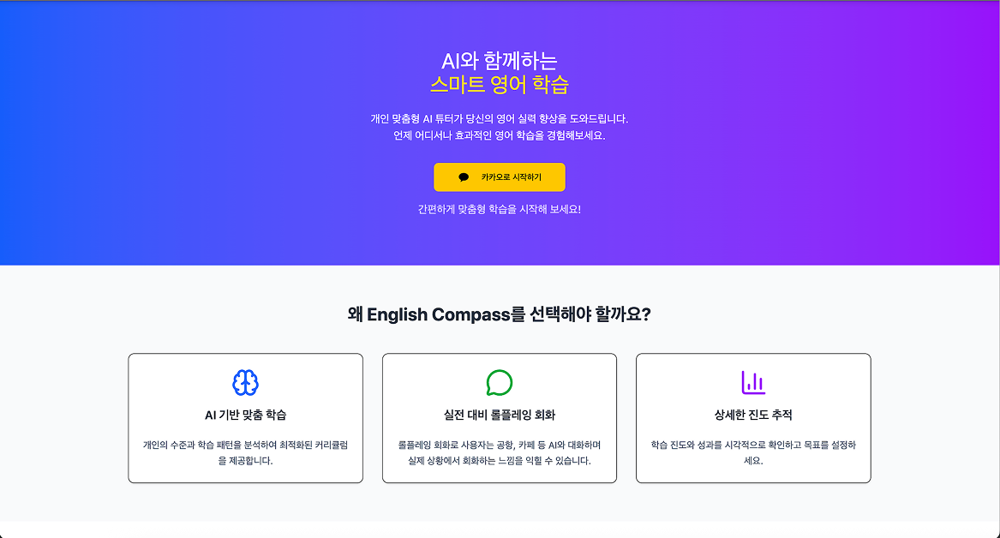
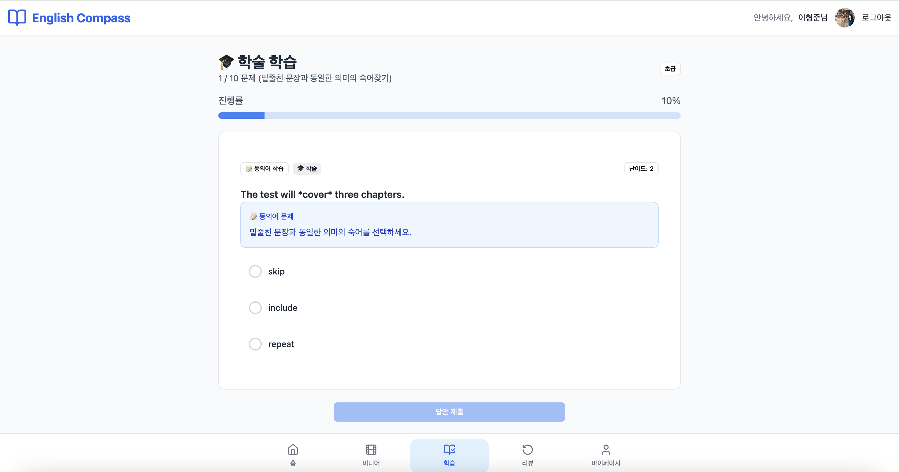
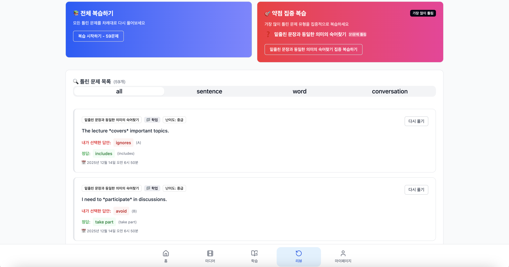

# 📘 English Compass - AI 기반 영어 학습 웹 애플리케이션

<div align="center">


**React + Vite 기반의 AI 영어 학습 웹앱**  
학습 목적과 실력에 따른 맞춤 커리큘럼과 실시간 피드백, OTT 기반 콘텐츠 추천을 제공합니다.

[시작하기](#-시작하기) • [주요 기능](#-주요-기능) • [기술 스택](#-기술-스택)

</div>

---

## 🚀 시작하기

### 설치 및 실행

```bash
# 1. 저장소 클론
git clone https://github.com/English-Compass/FE.git

# 2. 디렉토리 이동
cd FE

# 3. 패키지 설치
npm install

# 4. 개발 서버 실행
npm run dev
```

개발 서버는 기본적으로 `http://localhost:5173`에서 실행됩니다.

---

## ✨ 주요 기능

### 1. 🏠 홈 대시보드

학습 현황을 한눈에 파악할 수 있는 대시보드입니다.

#### 📊 학습 분석 차트
- **주간 학습량**: 최근 8주간의 세션 완료 수를 막대 차트로 표시
- **유형별 정답률**: 문제 유형(빈칸 채우기, 문장 의미 파악, 대화 완성)별 정답률 분석
- **오답 유형 분포**: 카테고리별 약점을 도넛 차트로 시각화



#### 📈 주요 카드
- **오늘의 단어**: 추천 단어 학습
- **틀린 문제**: 최근 오답 목록
- **복습 퀴즈**: 빠른 복습 기능
- **대화 연습**: 회화 연습 바로가기

---

### 2. 📚 학습 페이지

AI 기반 맞춤형 문제를 풀며 실력을 향상시킵니다.

#### 문제 유형
- **빈칸 채우기**: 단어 학습 및 문맥 이해
- **문장 의미 파악**: 동의어 및 숙어 학습
- **대화 완성**: 상황별 적절한 응답 선택



#### 학습 흐름
1. 세션 생성 및 문제 할당 (10문제)
2. 문제 풀이 및 답안 제출
3. 실시간 정답률 및 진행률 표시
4. 학습 완료 후 결과 요약

---

### 3. 🔄 복습 페이지

틀린 문제를 다시 풀어 약점을 보완합니다.

#### 복습 기능
- **틀린 문제 목록**: 최근 학습 세션의 오답만 표시
- **문제 유형별 필터링**: 단어/문장/대화 유형별 분류
- **상세 정보 표시**: 
  - 사용자가 선택한 답안
  - 정답 및 해설
  - 문제 유형, 카테고리, 난이도
  - 푼 날짜 및 소요 시간



---

### 4. 🎬 미디어 페이지

관심사 기반 OTT 콘텐츠를 추천받아 학습합니다.

#### 미디어 기능
- **장르별 추천**: 비즈니스, 여행, 일상생활, 학업 등
- **학습 팁**: 미디어를 활용한 학습 방법 안내
- **시청 기록**: 학습한 콘텐츠 추적


---

### 5. 💬 대화 연습 페이지

실제 상황을 시뮬레이션하며 회화 실력을 기릅니다.

#### 대화 연습 기능
- **시나리오 선택**: 다양한 상황별 대화 연습
- **커스텀 상황**: 원하는 상황 직접 설정
- **역할 놀이**: 역할에 맞는 대화 연습
- **피드백 히스토리**: 과거 대화 기록 확인


---

### 6. 👤 마이페이지

학습 통계와 프로필을 관리합니다.

#### 프로필 관리
- **프로필 수정**: 난이도 및 관심 카테고리 변경
- **계정 관리**: 사용자 정보 확인

#### 학습 통계
- **주간 통계**: 최근 1주일 학습량 및 정답률
- **유형별 정답률**: 문제 유형별 성과 분석
- **학습 달력**: 월별 학습 활동 히트맵
  - 활동량에 따른 색상 강도 표시
  - 날짜별 문제 수, 정답률, 학습 시간 표시


---

### 7. 🔐 인증 및 초기 설정

#### 카카오 소셜 로그인
- 간편한 카카오 계정 연동
- 자동 사용자 정보 가져오기


#### 추가 정보 입력
- **관심 카테고리 선택**: 비즈니스, 여행, 학업, 일상생활
- **세부 키워드 선택**: 각 카테고리별 세부 관심사
- **난이도 설정**: CEFR 기준 (A: 초급, B: 중급, C: 상급)


---

## 🛠 기술 스택

### Core
- **React 19.1.0** - UI 라이브러리
- **Vite 7.0.4** - 빌드 도구 및 개발 서버
- **React Router DOM 7.7.1** - 클라이언트 사이드 라우팅

### UI & Styling
- **Tailwind CSS 4.1.12** - 유틸리티 CSS 프레임워크
- **Sass 1.90.0** - CSS 전처리기
- **Radix UI** - 헤드리스 UI 컴포넌트
- **Lucide React** - 아이콘 라이브러리
- **shadcn/ui 스타일** - 커스텀 UI 컴포넌트

### Data Visualization
- **Recharts 3.1.2** - 차트 라이브러리
  - BarChart (주간 학습량, 유형별 정답률)
  - PieChart (오답 유형 분포 - 도넛 차트)

### State Management
- **React Context API** - 전역 상태 관리

### Development Tools
- **ESLint** - 코드 품질 검사
- **PostCSS** - CSS 후처리
- **Autoprefixer** - 벤더 프리픽스 자동 추가

---

## 📁 프로젝트 구조

```
FE/
├── src/
│   ├── components/          # 재사용 가능한 UI 컴포넌트
│   │   ├── add-info/        # 추가 정보 입력 관련
│   │   ├── conversation/    # 회화 연습 관련
│   │   ├── home/            # 홈 화면 관련
│   │   ├── landing/         # 랜딩 페이지 관련
│   │   ├── media/           # 미디어 추천 관련
│   │   ├── mypage/          # 마이페이지 관련
│   │   ├── question-types/  # 문제 유형별 컴포넌트
│   │   ├── review/          # 복습 관련
│   │   ├── study/           # 학습 세션 관련
│   │   └── ui/              # 기본 UI 요소 (Button, Card, Badge 등)
│   ├── context/             # 전역 상태 관리 (AppContext)
│   ├── layouts/             # 페이지 레이아웃 컴포넌트
│   ├── pages/               # 라우팅되는 페이지 컴포넌트
│   │   ├── dashboard/       # 대시보드 관련 페이지
│   │   └── landing/         # 랜딩 및 로그인 관련 페이지
│   ├── routes/              # 라우팅 설정
│   ├── services/            # API 연동 서비스
│   └── styles/              # SCSS 스타일시트
├── public/                  # 정적 파일
├── package.json
├── vite.config.js          # Vite 설정
├── tailwind.config.js      # Tailwind CSS 설정
└── README.md
```

---

## 🎨 주요 화면 구성

### 네비게이션
- **하단 네비게이션 바**: 홈 / 미디어 / 학습 / 리뷰 / 마이페이지
- **상단 바**: 사용자 이름, 프로필, 로그아웃

### 페이지 라우팅
```
/landing              # 랜딩 페이지
/add-info             # 추가 정보 입력
/dashboard/home       # 홈 대시보드
/dashboard/media      # 미디어 페이지
/dashboard/study      # 학습 페이지
/dashboard/review     # 복습 페이지
/dashboard/conversation  # 대화 연습 페이지
/dashboard/my         # 마이페이지
```

---

## 📊 데이터 시각화

### Recharts를 활용한 차트

#### 1. 주간 학습량 (BarChart)
- X축: 주간 레이블 (예: "11월 3일주")
- Y축: 완료한 세션 수
- 동적 Y축 범위 조정

#### 2. 유형별 정답률 (BarChart)
- X축: 문제 유형 (빈칸 채우기, 문장 의미 파악, 대화 완성)
- Y축: 정답률 (%)
- 각 바 위에 정확한 퍼센트 값 표시

#### 3. 오답 유형 분포 (PieChart - 도넛 차트)
- 카테고리별 문제 수 분포
- 색상으로 구분된 카테고리
- 5% 이상인 경우만 레이블 표시

---

## 🔌 API 연동

모든 API 요청은 `/api` 경로를 통해 Gateway(`localhost:8080`)로 프록시됩니다.

### 주요 API 엔드포인트

#### 학습 관련
- `POST /api/problem/learning-sessions` - 학습 세션 생성
- `GET /api/problem/learning-sessions/{sessionId}/questions` - 문제 조회
- `POST /api/problem/learning-sessions/{sessionId}/answers` - 답안 제출
- `PATCH /api/problem/learning-sessions/{sessionId}` - 세션 완료

#### 분석 및 통계
- `GET /api/analysis/users/{userId}/daily-activity` - 일일 활동 조회
- `GET /api/analysis/users/{userId}/weekly-graph` - 주간 학습량
- `GET /api/analysis/users/{userId}/question-type-accuracy` - 유형별 정답률
- `GET /api/analysis/users/{userId}/weakness-distribution` - 약점 분포
- `GET /api/analysis/users/{userId}/calendar-heatmap` - 학습 달력

#### 복습 관련
- `GET /api/problem/quiz/users/{userId}/wrong-questions` - 틀린 문제 조회

---

## 🎯 주요 특징

### 1. 맞춤형 학습
- 사용자의 관심 카테고리와 난이도에 맞춘 문제 제공
- 실시간 정답률 및 약점 분석

### 2. 데이터 시각화
- Recharts를 활용한 직관적인 차트
- 학습 활동 히트맵으로 시각적 피드백

### 3. 반응형 디자인
- 모바일 및 데스크톱 최적화
- Tailwind CSS 기반 반응형 레이아웃

### 4. 사용자 경험
- 직관적인 네비게이션
- 실시간 학습 진행률 표시
- 상세한 피드백 및 해설

---

## 📝 개발 가이드

### 코드 스타일
- ESLint를 통한 코드 품질 검사
- React Hooks 기반 함수형 컴포넌트
- Context API를 통한 전역 상태 관리

### 스타일링
- Tailwind CSS 유틸리티 클래스 우선 사용
- SCSS 모듈을 통한 컴포넌트별 스타일
- shadcn/ui 스타일의 커스텀 컴포넌트

### 상태 관리
- `AppContext`를 통한 전역 상태 관리
- 로컬 상태는 `useState` 훅 사용
- API 호출은 `services/api.js`에 중앙화

---

## 📸 스크린샷 추가 방법

프로젝트 루트에 `docs/screenshots/` 디렉토리를 생성하고 다음 파일들을 추가하세요:

```
docs/
└── screenshots/
    ├── home-dashboard.png
    ├── study-page.png
    ├── review-page.png
    ├── media-page.png
    ├── conversation-page.png
    ├── mypage.png
    ├── landing-page.png
    └── add-info-page.png
```

---

## 🤝 기여하기

1. Fork the Project
2. Create your Feature Branch (`git checkout -b feature/AmazingFeature`)
3. Commit your Changes (`git commit -m 'Add some AmazingFeature'`)
4. Push to the Branch (`git push origin feature/AmazingFeature`)
5. Open a Pull Request

---

## 📄 라이선스

이 프로젝트는 MIT 라이선스를 따릅니다.

---

## 👥 팀

English Compass 개발팀

---

<div align="center">

**Made with ❤️ by English Compass Team**

[⬆ Back to Top](#-english-compass---ai-기반-영어-학습-웹-애플리케이션)

</div>
